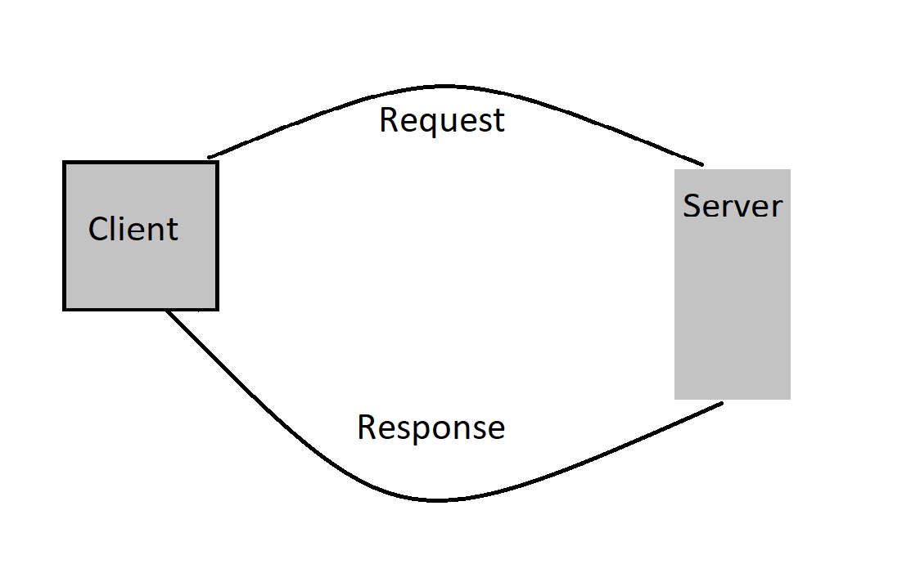
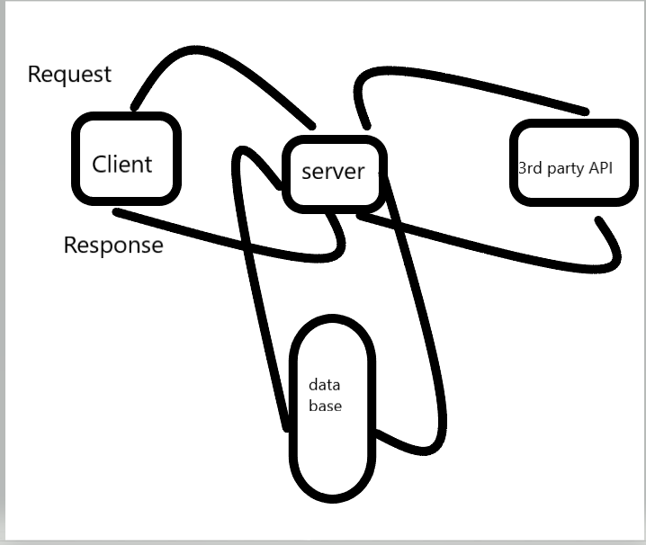
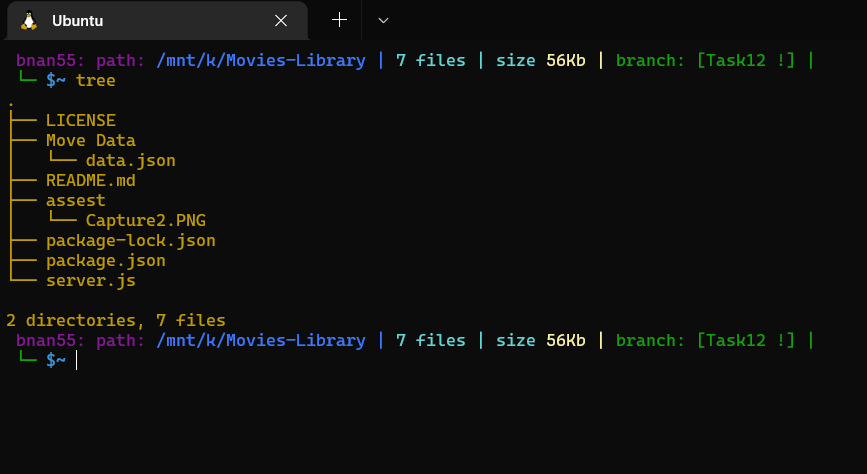

# Project Name: Movies-Library Project Version: 1.1.0

**Author Name: Bnan Zhran**

## WRRC

**My Project tree**

## Overview

## Getting Started
<!-- What are the steps that a user must take in order to build this app on their own machine and get it running? -->
**The user must go to the corresponding page and send resquest**
## Project Features
<!-- What are the features included in you app -->
**It filters all information into information that is useful to the user**
What observations or questions do you have about what you’ve learned so far?

Nothing.

How long did it take you to complete this assignment? And, before you started, how long did you think it would take you to complete this assignment?

It take a hour.